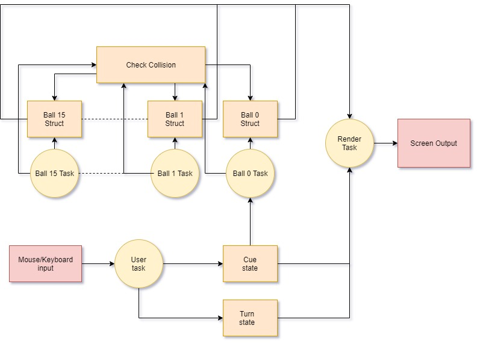
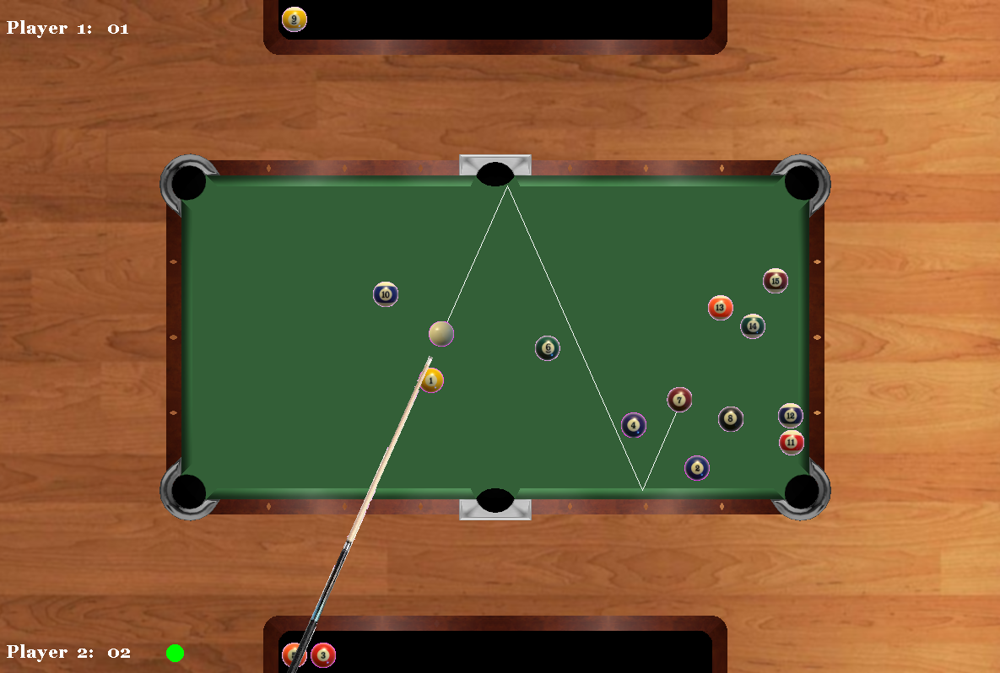

# Pool_Allegro
Project for the University course "Real-Time Embedded Systems" (Computer Engeneering UniMoRe), implementing a multithread pool game in C using the Allegro 4.0 library.

## Installing Allegro
As previously stated we used the open source library Allegro (version 4.0) to handle the graphics in C, and in order to use this game you will need to install it on your computer. 

If you install it from the Linux terminal you just have to type:

```
$ sudo apt-get install liballegro4-dev
```

## How to launch
In order to play the game, the first time you will have to compile it, just write in the terminal:
```
$ make -f makefile
```
If you made changes in the headers library and want to recompile put:
``` 
$ make clean
$ make -f makefile
```
Then to launch the game:
```
$ ./main
```
## Rules
This is a very simple pool game, played by 2 players.
There is no restriction on the type of balls you have to put in the holes, every ball (*except the white ball*) counts as 1 point, at the end of the game, when only the white ball remains, the player with the most amount of points will be proclaimed the winner.

## Commands and Keys

* To aim for the shot, use your mouse input, the cue will follow your mouse cursor.
* At your first right mouse click the direction of the shot will be saved, and a cue animation starts in order for you to choose the shot power, the further the cue is from the ball the strongest will be your shot.
* At your second right mouse click, the power will be locked and your shoot will start.
* To quit the game before it ends press **ESC**.
* To enable the amateur mode, which will display the trajectory of the white ball while aiming press **A**.
* When the game has finished if you want to restart and play another game press **ENTER**.
## Tasks
* BALL:
    - Each ball is a periodic task, which can update its position and speed and look for the position and speed of the other balls in order to make the calculation the most accurate possible.
    - It handles all type of collisions.
    - It handles when the ball enters in a hole.
* USER:
    - It updates the cue's position when it is the aiming phase, following your mouse cursor.
    - It updates the power of the shot according to the cue's position when the second click occurs.
    - It handles the turns between players.
* RENDER:
    - It refreshes the screen at any given frame, looking at the user state and at all the balls positions.
    *Note: To minimize the flickering effect, we create a buffer where we upload the whole constructed bitmap and then upload it to the screen buffer all at once.*
    - It displays the white ball's trajectory depending if amateur mode is on or off.


    
    
 
## Screenshot of an ongoing match


 

